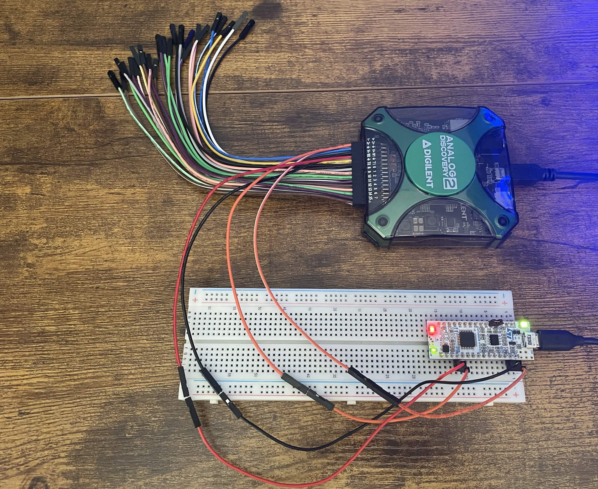
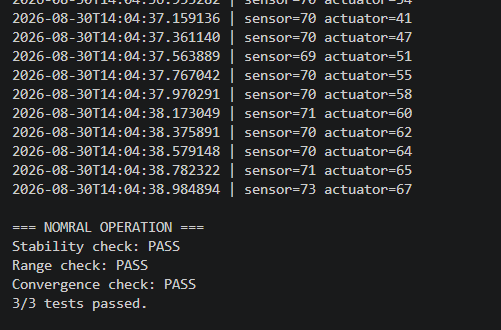

# LM Embedded Controller

A real-time embedded control system built on an STM32 microcontroller, paired with a Python-based test harness that mirrors Hardware-In-The-Loop (HIL) style validation used in embedded/flight software testing.

## Overview

This project implements a closed-loop control system: an STM32 reads a real analog sensor value (via ADC), runs it through a proportional controller, and drives a real physical output (an LED via PWM) toward that target in real time. A companion Python harness listens over serial, logs the data, sends commands to inject fault conditions, and runs automated pass/fail checks against the system's behavior.

## Architecture

- **Firmware (C, STM32 HAL):** reads a real analog input via ADC, runs a proportional control loop to drive a PWM output toward that target, and streams both values over UART. Also listens for serial commands (interrupt-driven) that can override the sensor reading for fault-injection testing.
- **Test Harness (Python):** reads the serial stream, logs data to CSV, sends fault-injection commands, and runs automated checks:
  - **Range check** — output stays within expected physical bounds
  - **Stability check** — no erratic/runaway jumps between readings
  - **Convergence check** — output demonstrates sustained tracking of the input somewhere in the run, not just a lucky single match

## Tech Stack

- **Firmware:** C, STM32 HAL, PlatformIO
- **Hardware:** STM32 Nucleo-32 (F303K8), Analog Discovery 2 (analog input source)
- **Test Harness:** Python, pyserial

## Example Output

.
3. Connect a real or simulated analog voltage source (0-3.3V) to pin PA0.
4. Install harness dependencies: `pip install pyserial`
5. Update the `PORT` variable in `harness/harness.py` to match your board's COM port.
6. Run `python harness.py` from the `harness/` folder.
